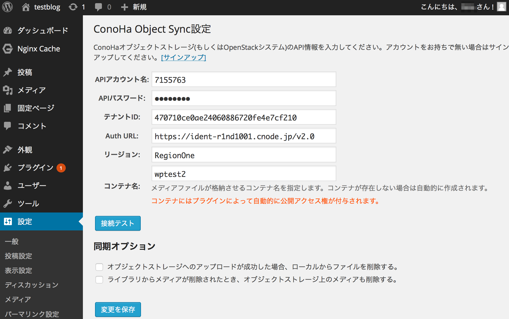

# WordPress plugin for ConoHa Object Storage.

WordPressのメディアファイル(画像など)をConoHaオブジェクトストレージで扱うためのWordPressプラグインです。

WordPressの管理画面からメディアを追加すると、自動的にオブジェクトストレージにアップロードを行います。オブジェクトストレージは容量無制限なため、空き容量を気にすること無くメディアファイルを扱うことができます。

また、このプラグインはメディアファイルのURLを変更し、オブジェクトストレージから直接配信するように設定します。これにより、WordPressを運用しているサーバに負荷をかけずに、メディアファイルを配信することができます。

ConoHaオブジェクトストレージ以外でも、OpenStack Swiftがベースのシステムであれば動作すると思います(未検証)。

wordpress.org上のページもご覧下さい。
https://wordpress.org/plugins/conoha-object-sync/

## スクリーンショット




## インストール

WordPressの管理ページからインストール可能です。


## インストール(手動)

手動でインストールする場合は次のようにしてください。

1. 以下のコマンドを実行してください。
2. 管理画面の「プラグイン」メニューから有効化してください。

```bash

# Move into WordPress root
cd [WORDPRESS_ROOT]/wp-content/plugins

# Clone plugin repository
git clone https://github.com/hironobu-s/conoha-ojs-sync
cd conoha-ojs-sync

# Install PHP OpenCloud via composer 
curl -sS https://getcomposer.org/installer | php
./composer.phar install

```

# License

GPLv2
